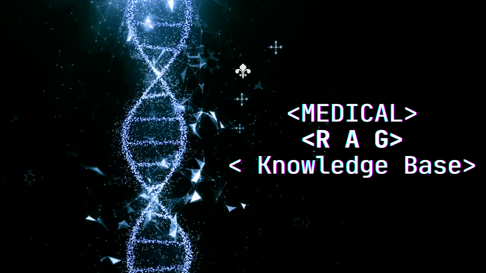

      
    

Medical RAG Knowledge Base - Healthcare Document Retrieval System

Medical RAG Knowledge Base is a powerful healthcare document retrieval system built with Next.js and Pinecone. This app enables healthcare professionals to efficiently store, manage, and access medical documents, creating a streamlined workflow for medical research and knowledge retrieval.

🖥️ Tech Stack
Next.js: A React framework for fast, efficient web applications.
Pinecone: Vector database service for scalable real-time document retrieval.
Vercel: Frontend hosting and deployment.
📋 Features
Fast Document Indexing: Instantly index medical records and documents.
Vector Search: Use vector-based search to find relevant information in medical records.
Namespace and Index Management: Organize documents efficiently with namespaces and indices.
Responsive Design: Adaptable layout for all device sizes, from desktops to mobile.
🚀 Quick Start
Prerequisites
Ensure you have the following installed on your machine:

Git
Node.js
npm
Installation Steps
Clone the repository:

bash
Copy code
git clone https://github.com/yourusername/medical-rag-kb.git
cd medical-rag-kb
Install dependencies:

bash
Copy code
npm install
Set up environment variables: Create a .env.local file in the root of your project with the following content:

bash
Copy code
PINECONE_API_KEY=your_pinecone_api_key
NEXT_PUBLIC_NAMESPACE=your_namespace
NEXT_PUBLIC_INDEX_NAME=your_index_name
Replace the placeholder values with your actual credentials.

Run the development server:

bash
Copy code
npm run dev
Open http://localhost:3000 in your browser to view the app.

📝 Sketch Section
Here's an early sketch of the document upload and indexing interface:

  

This represents the interface where users can upload medical documents, manage indices, and track upload progress in real time. The large button is for triggering file uploads.

📱 Contact
If you have any issues or questions, feel free to reach out!

Built with ❤️ by Oclaz
